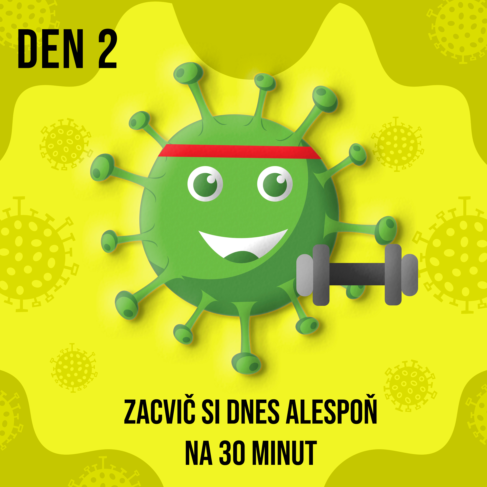

# My first project in which I realize the power of copying.
My Corona Challenge project is also partially copied. My main mascot of the whole campaign is a corona-virus with eyes and a smile, but I copied the shape of this mascot 
from the Internet. Someone designed the visual of the virus this way, and I was inspired.

