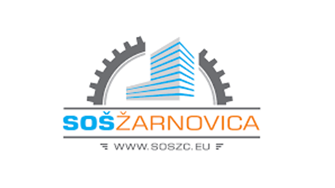
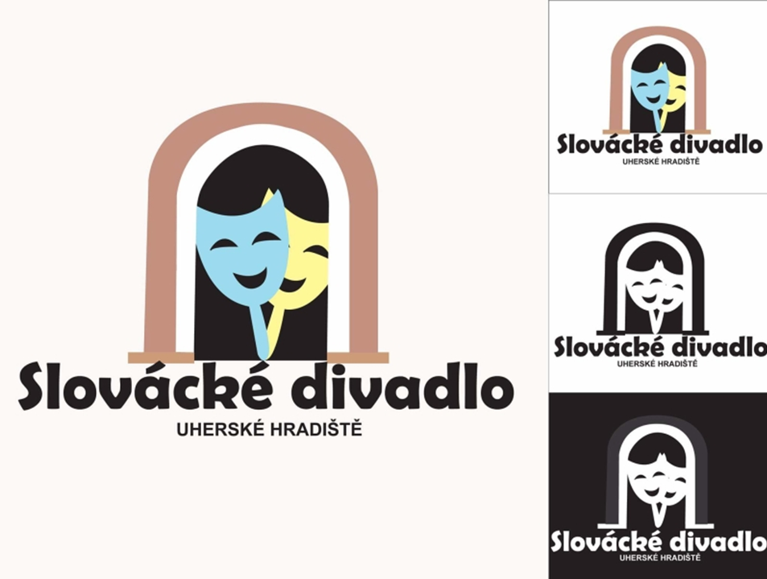
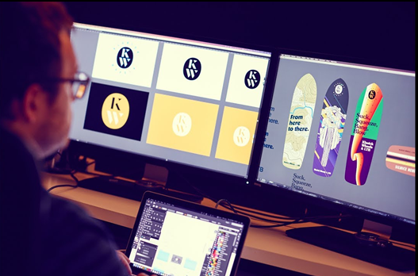
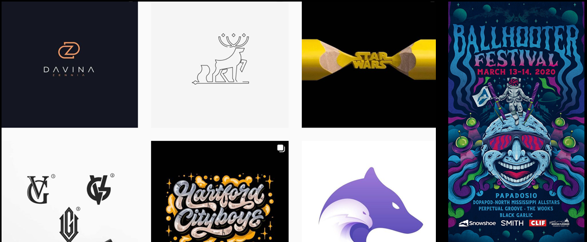

# HI, I'M MIRIAM
A self-proclaimed graphic designer based in Prague with a full head of creativity, dreams and goals. ❤️

# MY STORY AS A DESIGNER
In this presentation, I decided to tell my story as a designer. It will be about me, my journey to be graphic designer and I show you some of my projects and 
I hope you enjoy it with me.

# PRIMARY SCHOOL
I started to be interested in design as such at primary school, where I edited photos in various unpaid programs, 
I edited videos for my friends and drew various characters on paper on my free time.

# APPLY FOR HIGH SCHOOL
When we had to decide where to apply for high school, I didn't hesitate to go to Secondary Vocational school, which offered study section - graphic of digital media.

# HIGH SCHOOL
At this school, they taught us how to work in Adobe graphics programs, we learned to take and edit photos, shoot short videos and then edit them, 3D modeling, we learned how created logos and printed materials, how created animations and basics of creating web pages. I enjoyed everything and I was slowly learning things that a good designer should know.

# MY FIRST DESIGNS
I'll show you some of my first designs from my High School. They're not perfect, but the beginnings are always difficult, and despite all the mistakes, I'm proud of them because they started my passion for design.

This is a logo design for the Slovácko Theater in Uherské Hradiště, which we created at the high school, it's one of my first logo design.

This is one of my first 3D models in Blender. The topic our professor assigned us was "fence." So I created a garden with a swing, a bench, and a well.

And this is one of the first illustrations I created in Adobe Illustrator. Of course, if I do not count the first wheels, squares, and houses. It is a drawing of an actress from the American Horror Story series.

# CONTINUE?
In the last years of my high school studies, I decided that I wanted to continue my education in this field because I enjoyed it, it brought me joy and I was clear in what I want to do after school. So I applied to the University of Creative Communication in Prague, which fascinated me with its approach, and I was very much looking forward to being able to join this school. 

# LIFE ON UNIVERSITY
At this school, I learned many new things that I will use in my future career. For example creation of corporate identities, the creation of prototypes of applications and websites, the basics of typography, the basics of marketing communication, typesetting, and a lot of lectures with professionals in our field. So let’s see some my work on this university.

I probably don't have to describe the first of my designs anymore, because you know it from my CASE STUDY and VOICE AND TONE. So, yes, it’s visual style of The Festival of Bollywood film. 

Here are a few of my poster designs I made in the previous year. The first is a politically oriented poster that addresses the issue of corruption in the judge. The second is an ISOTYPE poster, the latter shows the number of weddings and the number of divorces in Prague from 1920 to 2010. And the last poster is created for the De Stijl exhibition in Prague.

Here is a work from the first year, from our final exam, which I worked on with my two classmates Lukáš and Tetiana. It's a cover design for band ABBA.

On the next slide, I have a logo design for the Gallery of Modern Art in Hradec Králové.

And the last of the my works that I want to show you is the design of an application for the Louvre Museum. For this application, I made a complete prototype in Adobe XD.

# NOW
Now I am working hard on my bachelor's thesis, which will be one of my best designs. I hope.
Finally, I'm finishing my web portfolio, which you can see at this link if you want.

# MY INSPIRATION
My big inspiration in design is Pavel Fuksa, Czech graphic designer, illustrator, and creator of advertising campaigns. He has worked for Microsoft, Google, Twitter, Facebook, The Independent, Nike, Heineken and Budweiser. For former US President Barrack Obama formed a campaign on Youtube. He is very cool, and he is my idol in design world. 

Here is some of his design. It’s pretty cool I think.

# MY INSPIRATION
Furthermore, I am inspired by various pages on Instagram or Behance, which are full of incredibly talented artists, designers, and in their work, I always say to myself that I will one day create such perfect designs.

# CLOSING SPEECH
In my designs, I constantly try to move, try new things, new trends and I try to improve and learn from the best. After all, we learn all our lives. I want to focus on design, learn, and improve the world with my works.

And that's all in this presentation, thank you for your attention and stay creative.

