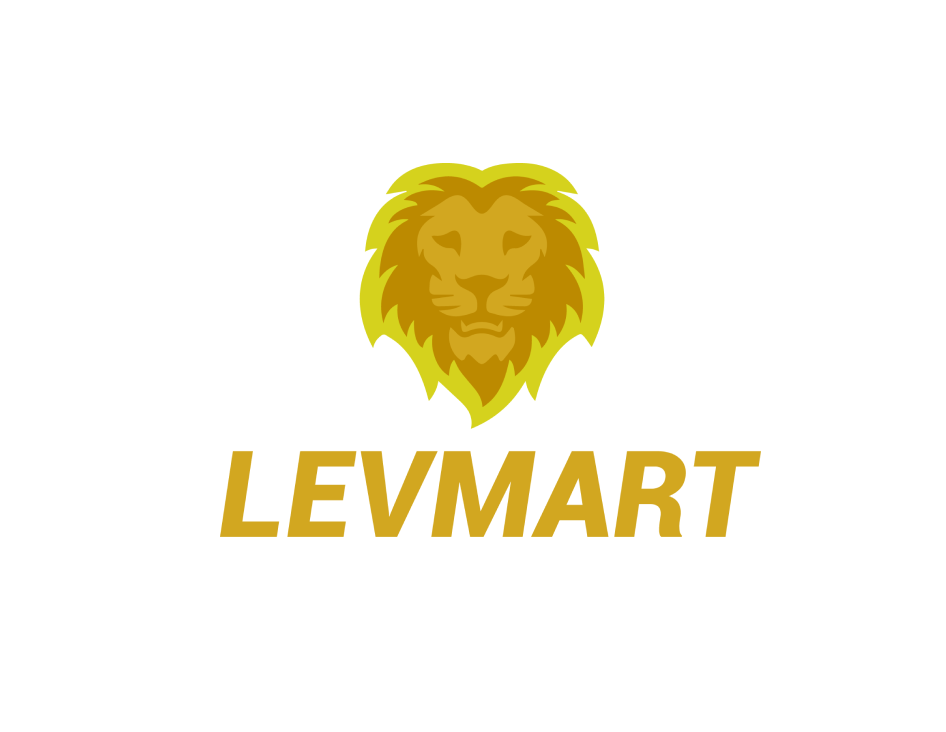

# Corporate Identity Design of startup

### Keywords
brand, corporate identity, brand, brand creation, visual identity, logo creation, brand communication

### Motivation/Problem/Opportunity
The motivation or problem that I wanted to solve with my bachelor's thesis was that I wanted to create 
a unique organization that would make life more pleasant for the inhabitants who live in the given district. 
Because it's a startup, I didn't have to bid on any restrictions, no rules and I could come up with any 
visual style and communication of the company.

### Thesis
This bachelor thesis deals with the creation of the corporate identity of a startup company. In the theoretical part, 
on the basis of professional literature and other research are named important elements and procedures for the successful construction 
of a start-up brand. The process addresses all the important elements for creating a corporate identity. 
The practical part uses the acquired knowledge from the used literature, as well as from the study itself and implements them 
to create a visual style of the company, create brand communication and sketch the company's marketing.

### Approach/Methodology
The method I decided to explore the topic it is an extensive survey of competitors and other successful companies, 
guaranteed prosperous strategies from various global experts, analysis of the market segment, which deals 
with corporate identity and study of building a new brand.

### Results/Outcomes/Analysis
The results I found after examining the purchasing power in a given district were that people would really want such a company in their district. 
After studying the communication of the competition, I found out that they communicate with their customers in a very weak way and that 
if you want to attract a certain audience, you have to play with visual communication and the content that forms the company is important. 
Content first!

### Conclusion
In conclusion, I would like to add that I managed to create a unique company that will definitely impress with its attitude, 
its play towards the customer and unique visual and creative solutions. After mapping out competing companies, I found out that this company 
has a vision to become a successful brand that has to become a lovebrand. 
In today's oversaturated market, it is important that the brand stands out from the crowd and is something unique to attract potential customers.
