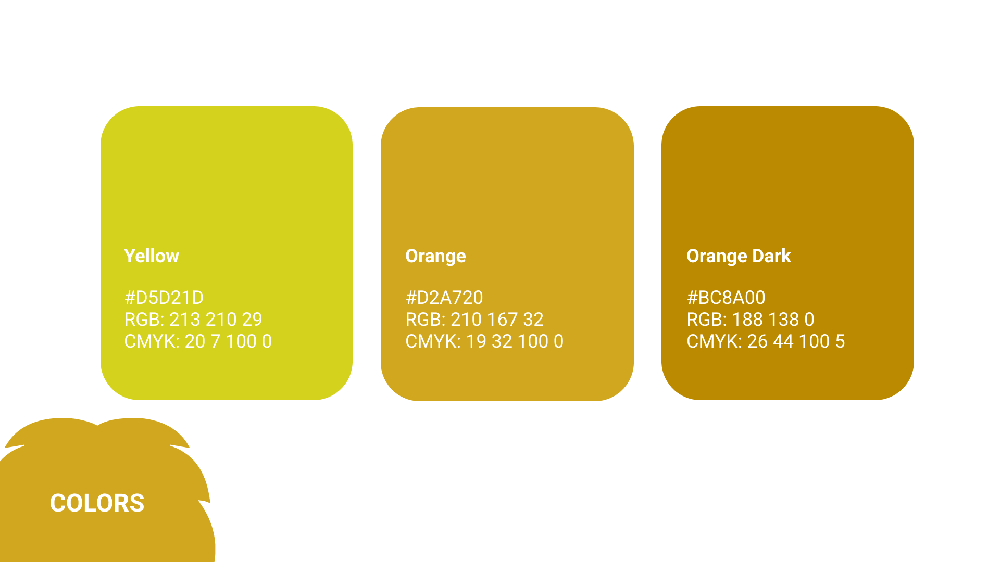
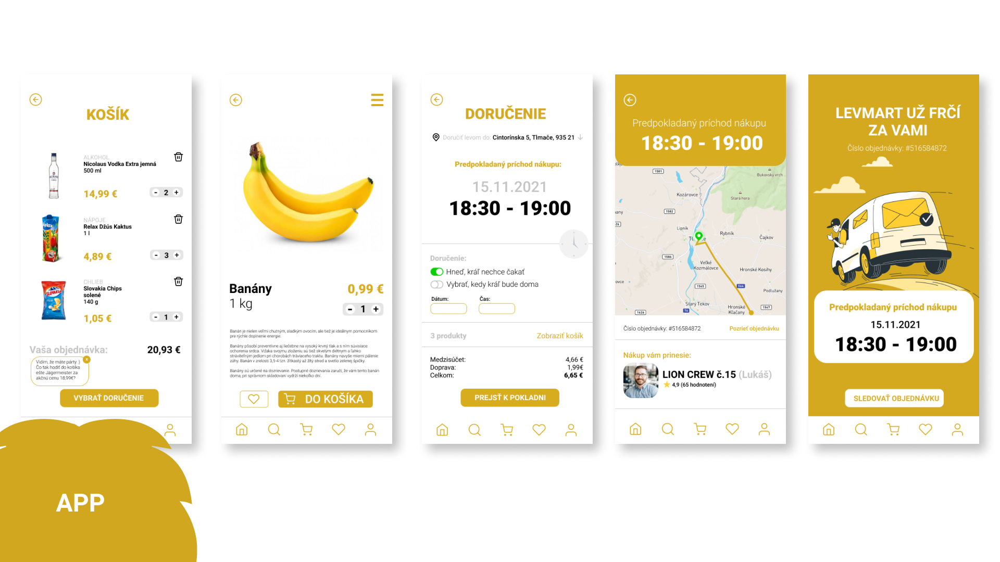

<a href="miriam-vojcekova.github.io/08-summary-details/final_presentation.pdf" target="_blank"> View PDF presentation </a>

# Corporate Identity Design of startup

My bachelor's thesis deals with the creation of the corporate identity of a startup company 
that provides delivery of grocery, medicine, drugstore, flowers and night delivery of alcohol.

## Abstract

This bachelor thesis deals with the creation of the corporate identity of a startup company. In the theoretical part, on the basis of professional literature 
and other research are named important elements and procedures for the successful construction of a start-up brand. The process addresses all the important 
elements for creating a corporate identity. The practical part uses the acquired knowledge from the used literature, as well as from the study and implements 
them to create a visual style of the company, create brand communication and sketch the company's marketing.

### Keywords
brand, corporate identity, brand creation, visual identity, logo creation, brand communication, corporate identity

## Article
The bachelor's thesis is based on the creation of the corporate identity of the start-up company LevMart. 
LevMart is a new company, founded in the Levice District in Slovakia, which brings the service of delivery of food, medicine, 
flowers, drugstore, various assortment and its offer also includes night delivery of alcohol. 
This service will be created to simplify the lives of the people who live in this district.

In the theoretical part, the bachelor's thesis deals with the basics of marketing communication, corporate image, the brand as a visual element, communication 
strategy and brand strategy according to experts who have been dealing with this topic for many years.

In the practical part, the bachelor's thesis deals with the application of acquired knowledge in practice, contains real proposals, 
proposals for communication strategy, merchandising and the attached appendices point to the visual side of the company.
The bachelor thesis aims to find and understand the correct procedure for building a new brand, apply the acquired knowledge, understand the needs of the target group and create a prosperous brand. The aim is to show Corporate Identity as a tool for building and changing the image of the subject - brand in a broader sense.

Building a new brand is always a difficult matter. It is important to understand the needs of the target group, is the people for whom this brand should work. 
Another important part of building a brand is to differentiate yourself from the competition, the brand must be new, unique and must have creative communication.
Both the theoretical and practical part of the bachelor's thesis gave me many interesting findings and sources of inspiration, which brought me closer 
and helped me better understand the creation of corporate identity. I have gained knowledge of useful practices that help create a start-up brand that has a vision to become successful, unique and different in creative solutions from competing companies.

