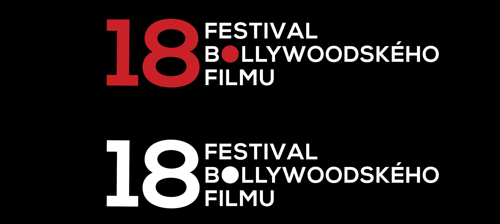
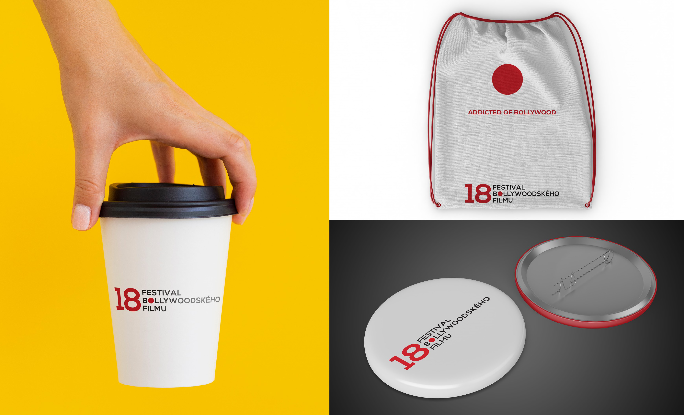
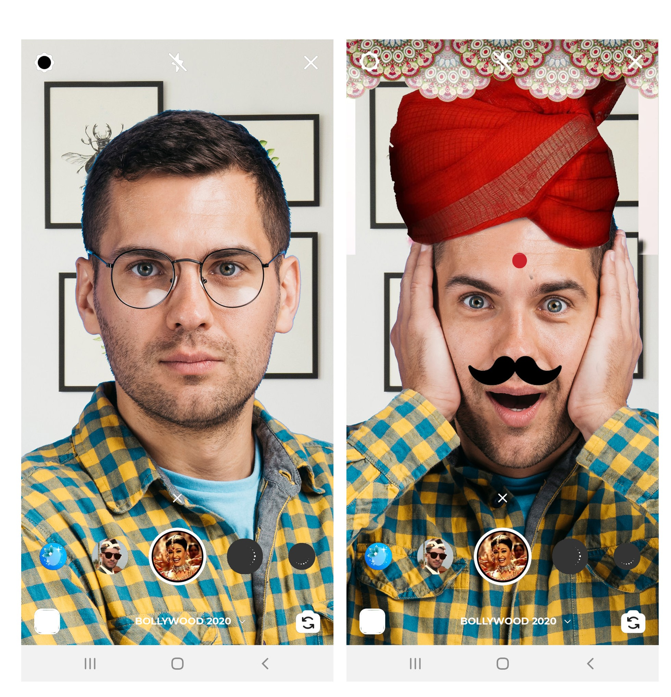

# About Me
Miriam Vojčeková, a self-proclaimed graphic designer based in Prague with a full head of creativity, dreams and goals. ❤️

# 01 - Character Description
I designed the letter M, which is my favorite letter in the alphabet. 
I gave him a luminous effect that follows the quote that is described below the picture. I designed this design in Adobe Photoshop.

# 02 - Intentional Aboutness

## Miriam Vojčeková

My name is Miriam and I study graphic design. I'm an introvert in my projects and I like to work on everything myself. 
But I don't mind working in a team either. I would like to be freelance after school. 
In my projects, I try to bring everything to the last detail, I try to work with an open mind and full creativity. 
I try to create creative solutions to unsolvable problems. 
I try to go to everything one hundred percent, because if we don't do it properly, then we have to don't do it. 
Otherwise, I love traveling, partying with friends and running.

## Visual style for the Bollywood Film Festival
#### The idea of the whole project
The visual style of the festival is based on a red dot, which symbolized married women in India, which actually represents the 18th year of the festival. 
18 years symbolizes adulthood, marriage, building a career, starting a family. 
The red dot plays the role of a restless dot in this concept, infecting the Bollywood mood of anyone it catches. 
Anyone who learns about Bollywood festivals will be endowed with an imaginary red dot that draws him into Indian culture and dances his senses.
The goal of the Bollywood Festival is for people to relax, get to know a new culture, have fun and be drawn into the magical Indian world, 
which enchants them with its otherness.

Bollywood evokes fun, joy, passion, love, mystery, laughter, humor, unexplored new culture.

The logo was designed simply with a red dot as the main element in the design.

The font that represents this design is called "Montserrat". 
I used it because it has many cuts that can be used on various advertising media, but also on social networks, or in ordinary communication in e-mails.

The posters reflect the idea that Bollywood can be loved by really everyone. Whether it's an old pensioner who loves Indian soap operas, 
a young woman who has traveled half of India, children who are fascinated by a different Indian culture, or even a dog who is happy 
to see her master shake off in the evening with Indian movies.

The design for the spot was conceived in such a way that ordinary people stand and wait for the subway, everyone is watching their own, until suddenly 
Indian music is heard from the microphone and a red dot appears from the radio, which gradually starts to mark everyone. 
Then people start dancing, having fun together with Indian music. They all run out of the metro and start dancing together, 
the red dot dances the whole of Prague (people, animals, buildings (eg Dancing House), trams).

<video> <video controls src="bollywood-spot.mp4"> </video>

T-shirts, tickets and other merch of this festival were designed with a simple and main element of the whole design, 
our red dot and therefore the primary colors were red, black and white.

The social networks of this project are solved through filters in the Instagram application, which mark the user with a red dot and thus also activate the clothes, which will change into typical Indian ones. Users can share this on their profiles and exchange photos with their friends.

The aim of designing this project was to introduce typical Czech people to the crazy Indian world, all with the help of a simple but strong element, namely a red dot.

# 03 - Curriculum Vitae
[View CV (PDF)](03-curriculum-viate/cv-2020-mvojcekova.pdf)

# 04 - Voice and Tone

## VI
Copying definitely belongs to the lives of all of us, and we may not even realize it. 
You have the knowledge you have that you have acquired from someone. So you copy their thoughts and have them stored in your head as your own. They also had to copy that knowledge somewhere and learn it. As long as people live and learn in the world, copying will always be there.

Nowadays, I have noticed the topic of copying mainly in the film industry. 
Film studios have begun to rework old animated films into new ones with better graphics and more realistic character rendering, but it's still just one story. 
For example: The Lion King, Snow White, Cinderella, Beauty and the Beast, etc. 
Overall, the movies are similar to each other, for example in teen American movies, the main character of a woman is always shy, she is in love with the most beautiful boy 
at school, who is mostly in the football team, has a best friend who is crazy and the main character's life is disturbed by the mean rich girls. 
Eventually, the boy usually falls in love with the shy girl and ends up together at the prom, where they kiss and everyone will be happy.
And this is how it is in thousands of teen films.

Of course, no one can claim that they are not copying. I also copy in my designs. Always before starting a project, I find a few pictures of the so-called moodboards. 
I'm inspired by Behance, Pinterest, or Google. I'm using a color palette that someone has created before. 
Download a font created by someone. I will just get inspiration from other designers and this will create my new design.

## Figure 6-1

My first project in which I realize the power of copying.
My Corona Challenge project is also partially copied. My main mascot of the whole campaign is a corona-virus with 
eyes and a smile, but I copied the shape of this mascot from the Internet. Someone designed the visual of the virus this way, and I was inspired.
There are photos of the coronavirus on the Internet, and I just added eyes and a smile to this shape, making this mascot friendlier, happier, and thus creating a new look for this virus, which I declare as my design.

## Figure 6-2

My second Bollywood Film Festival project differs in that it's more of combining images than copying. 
I took two photos, made a collage, added text, elements (red dot) and I created a new poster for the project's advertising campaign.

## Writing Style

I want to write clearly, and not be afraid to add a little humor into the text to bring a friendly and helpful tone to my writing style.

## Voice

1. Genuine
2. Original
3. Educational
4. Friendly

## Tone

1. Write effectively
2. Be Positive
3. Use humor for relief
4. Be friendly
5. Be careful when choosing certain words

For example:

When choosing the right words, we need to consider which target group we are talking about. 
For example, we will choose simple words for children, not too long, and we will speak in a playful way. For teenagers, we choose words that do not offend them and 
we speak carefully and try to be friendly. For adults (for example, university students) we choose words and tones that will not bore them, but at the same time 
we give them new information and new expressions, which we use to teach them to communicate properly.

