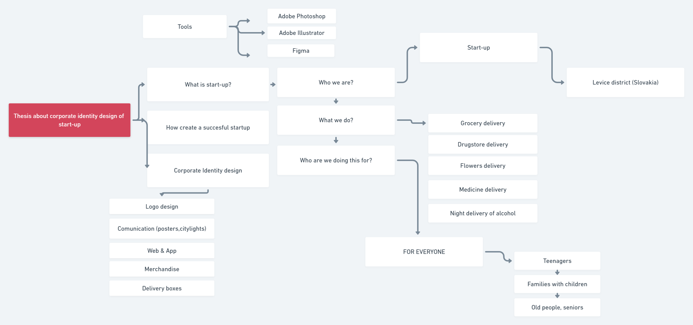

# CORPORATE IDENTITY DESIGN OF STARTUP

This project is about creating corporate identity design of fictitious start-up, which deals with grocery delivery, drugstore delivery, 
flowers delivery and night alcohol delivery.

  
Mind Map

### Voice & Tone
- **Voice:** Instructive, confident, informative
- **Tone:** Formal, friendly, pleasant

## Outline
1. Fictitious startup, which deals with delivery in the Levice district in Slovakia
2. Food delivery, medicine delivery, flower delivery and night alcohol delivery
3. Startup wants to be the best delivery service in the whole country
4. This company will work for all target groups - teenagers, families with children and pensioners
5. In this project, I will present the creation of a startup company that includes the entire visual style of the company

### Notes
- 
-
-

## Keywords
- Delivery
Delivery service
- Startup company
How to create a succesful startup?
- Corporate Identity Design
Colors, typeface
- Visual style
Logo design, Poster design, Design of delivery boxes and bags, bussiness card design, t-shirts for employees, app 

### References
- [APA Style Reference Examples](http://https://apastyle.apa.org/style-grammar-guidelines/references/examples)
- [Reference](http://)
- [Reference](http://)
